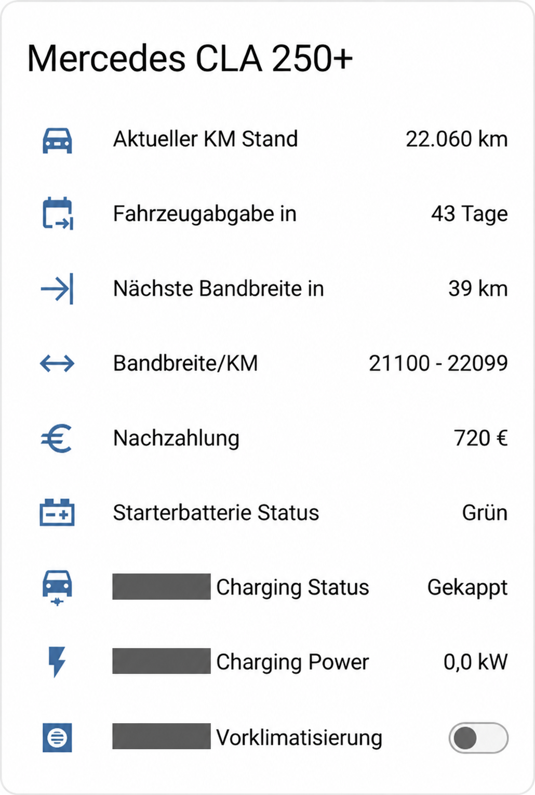

# Mercedes Members Mitarbeiter Leasing Information

[English](README.en.md)

## Beispielansicht



Anonymisierte, mit Bildbearbeitung aufbereitete Aufnahme des ursprünglichen Dashboards. Das Kennzeichen ist an allen drei Stellen verdeckt. Zusätzliche Fahrzeugwerte und Schalter gehören nicht zum Blueprint. Die ursprüngliche Anzeige zeigt 39 km bis zur oberen Bandgrenze; der korrigierte Blueprint zeigt bei 22.060 km **40 km bis zum Wechsel bei 22.100 km**.

Inoffizielle Home-Assistant-Vorlagen für Restkilometer bis zum nächsten Bandwechsel, aktuelle Kilometerbandbreite und zugehörige Nachzahlung.

## Installation

Voraussetzung: Home Assistant ab 2026.9 und ein bereits vorhandener Kilometerstand-Sensor in **km**. Dieses Projekt stellt keine Verbindung zum Fahrzeug oder zu Mercedes Members her.

1. Die drei YAML-Dateien aus [blueprints](blueprints) herunterladen.
2. In Home Assistant unter `/config/blueprints/template/mercedes_leasing/` speichern.
3. [examples/configuration.yaml](examples/configuration.yaml) in die eigene Konfiguration übernehmen. Existiert bereits `template:`, nur die drei Listeneinträge ergänzen.
4. In allen drei Einträgen `odometer` durch den eigenen Sensor ersetzen. `start_km` auf den Kilometerstand bei Leasingbeginn setzen; 0 verwenden, wenn der Sensor bereits die Vertragskilometer liefert.
5. Konfiguration prüfen und Template-Entitäten neu laden oder Home Assistant neu starten.

Die drei Sensoren verwenden je einen Template-Blueprint. Die Einbindung erfolgt über YAML; es ist keine HACS-Integration.
Für weitere Fahrzeuge die Einträge mit anderen Namen und eindeutigen `unique_id`-Werten wiederholen.
Vorhandene alte Sensoren erst nach Prüfung der neuen Werte ablösen; bestehende Dashboard-Referenzen gegebenenfalls anpassen.

## Eindeutige IDs

Die Beispielkonfiguration nutzt zufällig erzeugte UUIDv4-Werte als `unique_id`. Für jedes weitere Fahrzeug pro Sensor eine neue UUID erzeugen (z. B. `uuidgen` oder Python `uuid.uuid4()`) und dauerhaft beibehalten. Kopieren derselben UUID innerhalb einer HA-Instanz macht sie nicht erneut eindeutig. Auch eindeutige Text-IDs sind in HA gültig; UUIDs vermeiden unbeabsichtigte Namenskollisionen.

**Bestehende Installationen:** Bisherige `unique_id` nicht einfach ersetzen. Eine andere ID erzeugt eine neue Entitätsidentität; Dashboard-Verweise und Historienzuordnung können betroffen sein.

## Optional: alle Werte als ein Gerät

YAML-Template-Sensoren unterstützen keinen `device:`-Block. [examples/mqtt-device.yaml](examples/mqtt-device.yaml) ergänzt deshalb drei MQTT-Sensoren mit demselben `device.identifiers`-Wert und einer Automation, die die Blueprint-Werte überträgt. Dadurch erscheinen die **drei MQTT-Sensoren unter einem Gerät**; die drei Template-Sensoren bleiben als Berechnungsquelle bestehen.

Voraussetzungen: funktionierende MQTT-Integration mit Broker und die installierten Blueprint-Sensoren. Die drei Quell-Entitäts-IDs im Package müssen zu den tatsächlich angelegten HA-Entitäten passen.

1. Datei unter `/config/packages/mercedes_leasing_mqtt.yaml` speichern.
2. Packages in der bestehenden `homeassistant:`-Konfiguration aktivieren:
   ```yaml
   homeassistant:
     packages: !include_dir_named packages
   ```
   Vorhandene `homeassistant:`-/`packages:`-Einträge zusammenführen, nicht doppelt anlegen.
3. Konfiguration prüfen und HA neu starten.
4. Unter Geräte & Dienste → MQTT das Gerät „Mercedes Mitarbeiter-Leasing“ öffnen.

Die Automation sendet bei Änderungen, HA-Start und jede Minute. Ohne Nachrichten werden MQTT-Sensoren nach 180 Sekunden nicht verfügbar; ungültige oder unbekannte Zahlenwerte werden ebenfalls als nicht verfügbar gespiegelt. Nach einem Broker-Neustart wird innerhalb einer Minute erneut gesendet. Für weitere Fahrzeuge **alle UUIDs, das Topic und die drei Quell-Entitäten** ersetzen; innerhalb eines Fahrzeugs bleibt die Geräte-ID in allen drei Sensoren gleich (YAML-Anker).

Zum Entfernen das MQTT-Package entfernen und HA neu starten; die Blueprint-Berechnung bleibt bestehen. Es werden keine Discovery-Konfigurationen und keine Zustände dauerhaft auf dem Broker gespeichert.

Grundlagen: [Template-Blueprints](https://www.home-assistant.io/integrations/template/#using-blueprints), [MQTT-Geräte](https://www.home-assistant.io/integrations/sensor.mqtt/#device), [HA-Packages](https://www.home-assistant.io/docs/configuration/packages/).

## Berechnung und Grenzfälle


Vertragskilometer = Kilometerstand minus Startwert, abgerundet auf volle Kilometer.
Die Grenzen sind einschließlich. Bei 9.099 km bleiben 1 km bis 9.100 km; bei 9.100 km gilt die zweite Bandbreite und die Nachzahlung beträgt 240 EUR.
Die Restkilometer beziehen sich auf den nächsten **bekannten** Bandwechsel. In der letzten Bandbreite (37.100–38.099 km) ist kein weiterer Tarif bekannt: Restkilometer sind `unknown`, die Nachzahlung bleibt 2.940 EUR.
Ab 38.100 km lautet die Bandbreite „Außerhalb der Tariftabelle“, beide Zahlenwerte sind `unknown`.
Fehlende/ungültige Kilometerstände und Kilometerstände unterhalb des Startwerts machen alle drei Sensoren `unavailable`.

## Enthaltene Beispiel-Tariftabelle

Die Werte stammen aus der Ausgangskonfiguration des Projekts. **Tarifstand und vertragliche Gültigkeit sind nicht verifiziert.** Vor Verwendung mit dem eigenen Vertrag abgleichen. Die Werte sind eine Zuordnung zum aktuellen Kilometerstand, keine Prognose zum Vertragsende.

| Vertragskilometer | Nachzahlung (EUR) |
| --- | ---: |
| 0–9099 | 0 |
| 9100–13099 | 240 |
| 13100–17099 | 450 |
| 17100–21099 | 630 |
| 21100–22099 | 720 |
| 22100–23099 | 810 |
| 23100–24099 | 900 |
| 24100–25099 | 990 |
| 25100–26099 | 1140 |
| 26100–27099 | 1290 |
| 27100–28099 | 1440 |
| 28100–29099 | 1590 |
| 29100–30099 | 1740 |
| 30100–31099 | 1890 |
| 31100–32099 | 2040 |
| 32100–33099 | 2190 |
| 33100–34099 | 2340 |
| 34100–35099 | 2490 |
| 35100–36099 | 2640 |
| 36100–37099 | 2790 |
| 37100–38099 | 2940 |

Bei Änderungen die `limits`-Liste in allen drei Blueprints identisch ändern, zusätzlich `payments` in `nachzahlung.yaml`. Ein Betrag je Band; Grenzen streng aufsteigend.

## Prüfung

Die Regressionstests rendern die tatsächlichen YAML-Templates mit Jinja und prüfen alle Bandgrenzen, Startwert-Abzug, Dezimalwerte, ungültige Zustände und das Tabellenende.
Sie ersetzen keinen Integrationstest in Home Assistant.

```sh
python3 -m pip install -r requirements-test.txt
python3 -m unittest discover -s tests -v
```

## Hintergrund

Unabhängiges Community-Projekt, kein offizielles Angebot von Mercedes-Benz. Keine Zugangsdaten, Kennzeichen oder persönlichen Fahrzeug-IDs erforderlich.
Technische Grundlage: [Home Assistant Template-Blueprints](https://www.home-assistant.io/integrations/template/#using-blueprints).

## Lizenz

MIT; siehe [LICENSE](LICENSE).
